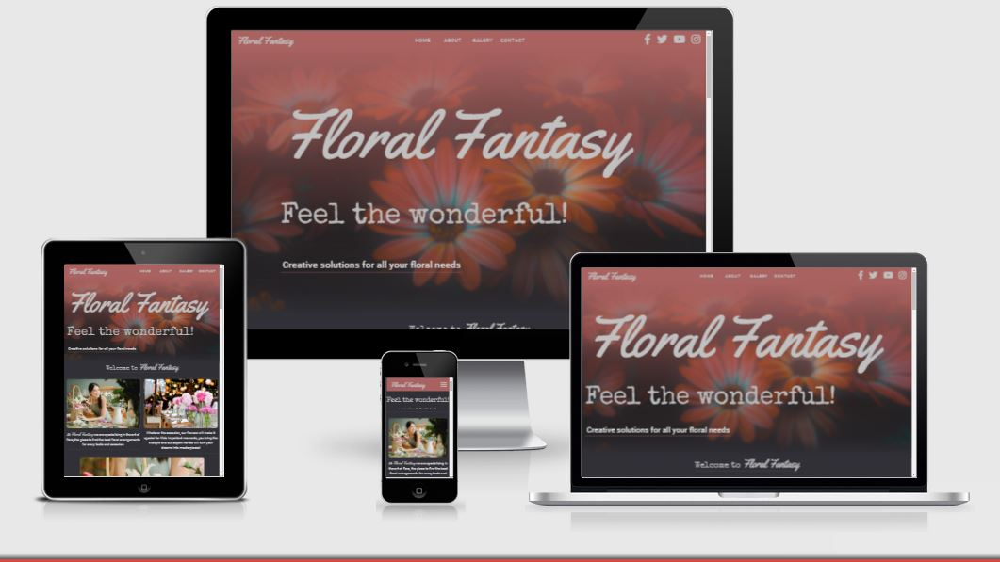

# Floral Fantasy  

## User Experience (UX), HTML5 and CSS, Milestone Project. 

 - ## [View the live project here.](https://raivis80.github.io/First-Milestone-Project/) 

## Table of contents

### 1. [Introduction](#Itroduction)

### 2. [UX](#UX)
  1. [External Visiror's goal's](#External-Visiror's-goal's)
  2. [Site owner's goal's](#Site-owner's-goal's)
  3. [Features](#Features)
### 3. [Design](#Design)
  1. [Colour Scheme](#Colour-Scheme)
  2. [Fonts](#Fonts)
  3. [Media](#Media)
  4. [Languages](#Languages-Used)
  5. [Technologies Used](#Technologies-and-Frameworks)
  6. [Wireframes](#Wireframes)
  7. [Site Layout Design](#Site-Layout-Design)     
### 5. [Testing](#Testing)
  1. [W3C Markup Validator](#W3C-Markup-Validator)
  2. [Further Testing](#Further-Testing)  
### 7. [Deployment](#Deployment)
  1. [Deployment on GitHub Pages](#Deploying-on-GitHub-Pages)
  2. [Forking the Repository](#Forking-the-Repository)
  3. [Creating a Clone](#Creating-a-Clone)
### 8. [Credits](#Credits)
  1. [Helpfull sites](#Helpfull-sites)
  2. [Images](#Images)
  3. [Acknowledgements](#Acknowledgements)

## Itroduction

This website was designed for florists, The man focus of the site is to create an online presence allowing members to receive fast venu or, occasion flower arrangement quotes from the best wedding florists and to find out relevant information. 

This is the first of four Milestone Projects that the developer must complete during their Full Stack Web Development Program at The Code Institute. 

The main requirements were to make a responsive website with a minimum of three pages using primarily *HTML5* and *CSS3*.

## UX

 - ### External Visiror's goal's
        1. To receive - flower Bouquets arrangements, Event arrangements quotes.
        2. To be able to navigate throughout the site to find any occasion flower arrangements.
        3. To locate Information on the location, contact details.
        4. To locate links to social media for external resources. 

 - ### Site owner's goal's
        1. To be able to attract and retaining potential customers.
        2. Showcase photos from the flower Bouquets, Events catalog.
        3. merchandise occasion flower arrangements.
        4. To Provide Social media links to external resources and contact information.

 - ### Features
    - Responsive on most device sizes.
    - Interactive elements.
    - Thumbnail picture gallery.
    - Contact Form and contact Information.
    - links to external resources, such as social media.

## Design
- ### Colour Scheme
    -   Colour palette used [View](https://coolors.co/8a5275-bc626f-35372f-a96260-9e5785-ebebeb-1d1d20)
- ### Fonts
    -   ROBOTO font is the main font used Serif as the fallback, family Yellowtail and family Special Elite was used for most headings.
- ### Media
    -   Large, background image is designed to be striking and catch the user's attention.
    -   Photo Gallery & Product Image Gallery helps you display and promote product or service.
- ### Languages Used
    -   [HTML5](https://en.wikipedia.org/wiki/HTML5) Hypertext Markup Language (HTML)
    -   [CSS3](https://en.wikipedia.org/wiki/Cascading_Style_Sheets) Cascading Style Sheets (CSS)

- ### Technologies and Frameworks
    - [Bootstrap 5.0.0-beta2:](https://getbootstrap.com/docs/5.0/getting-started/download/)
        - Bootstrap was used to assist with the responsiveness and styling of the website.
    - [Google Fonts:](https://fonts.google.com/)
        - Google fonts were used throughout the site.
    - [Font Awesome:](https://fontawesome.com/)
        - Font Awesome was used throughout the website to add icons.
    - [jQuery:](https://jquery.com/)
        - jQuery came with Bootstrap.
    - [Git](https://git-scm.com/)
        - Git was used for version control.
    - [GitHub:](https://github.com/)
        - GitHub is used to store the projects code.
    - [gitpod.io](https://gitpod.io/)
        - gitpod Was used for codding.
    - [Balsamiq:](https://balsamiq.com/)
        - Balsamiq was used to create the wireframes.

- ### Wireframes


- ### Site Layout Design
  - Website features Long-Scrolling Design with 4 full pages on Pesonal Computers and 3.5 pages on mobile devices.
  - Website is Responsive on most devices such us mobile device with resolution of 320x568p and larger as 1980x1280p on desktop PC's.

    #### **NavBar**
    - Features custom NavBar using some Bootstrap5 elements such us.. Display property "d-none d-sm-block".... to display, hide items to viewport size, also used customized bootstrab "drop-down" item for mobile devices.
    - NavBar is Fully responsive, it has 3 designs.. one for desktop computers, one for tablet devices and one for mobile devices.
    - NavBar has Features such us: "Site Link Element" To Help navigate the site "Social Media Links" element displays link icons to various social media platforms and Clickable "Brand link element" once clicked owuld reload the page.
    - NavBar has display Property "Fixed" As you scroll, it will remain fixed to the top of your browser's viewport.
    

    #### **Home Page Design** 
    - Large background Image spans the full width across the whole viewport size Horizontally and shrinks in size as viewport decreases.
    - Gradient overlay was used over image to blend Image with NavBar and website background color, also to overlay over image was used positioning values of absolute for image and relative on overlay"
    - Home Page Large font was set min & max font size in CSS that is responsive to all other browser sizes. Positioning text over image with CSS element "position: absolute" along with "z-index".
   
    #### **About Page Design** 
    - About Us page features three visualy apealing, descriptive images, speaking to user before the quote does.
    - Each image has one very telling quote, describing user who the company is, why choice the company and what company does.   
    - About us page was designed flexbox layout design for responsive website.   
        
        *Originaly about pabe was designed using CSS properties such as float, positioning of elements but later it was redesigned as it was inconvenient for responsive design and required element repositioning on each screen size, later It was redesigned to be responsive following FlexBox Design as for viewport width changes sizes.*
    
    - Top Picks Feature 
        - Top Picks Feature, features four thumblail images with current offers for the company. 
        - Top Picks Feature was designed to be responsive and using FlexBox design for responsiveness.
        - It was designed to overlap each image using negative margin and z-index. Text was palced over the images using "position:absolute".
        - :hover element was used with transition effects "rotate, translate and scale" for each card to create visual effect such us scale and rotate 6deg on mouse-over.
    
    #### **Picture Galery Design** 
    - Thumbnail Gallery a grid of images that when clicked on, open in a pop-up full view images. 
    - The gallery configuration designed to have smaller images for Thumbnails and Large Images stored separately on the website.
    - The gallery is fully responsive, bootstrap Grid system was used for responsive galery layout desing.
    #### **Contact Page Design** 
    - Review Cards 
    - Contact Form
    
    #### **Footer**
    - 
## Testing
### W3C Markup Validator
The W3C Markup Validator and W3C CSS Validator Services were used to validate every page of the project to ensure there were no syntax errors in the project.

-   [W3C Markup Validator](assets/project-files/validators/HTML-Vaalidator.pdf)
-   [W3C CSS Validator](assets/project-files/validators/CSS-Validator.pdf)

### Further Testing
-   Chrome DevTools was used to Test variety of devices such as Desktop, Laptop, iPhone7, iPhone 8 & iPhoneX for responsiveness.
-   Testing was done to ensure that all Links were linking correctly.

## Deployment
- ### Deploying on GitHub Pages
1. Log into [GitHub](https://github.com/login "Link to GitHub login page") or [create an account](https://github.com/join "Link to GitHub create account page").
2. Locate the [GitHub Repository](https://raivis80.github.io/First-Milestone-Project/ "Link to GitHub Repo").
3. At the top of the repository, select Settings from the menu items.
4. Scroll down the Settings page to the "GitHub Pages" section.
5. Under "Source" click the drop-down menu labelled "None" and select "Master Branch".
6. Upon selection, the page will automatically refresh meaning that the website is now deployed.
7. Scroll back down to the "GitHub Pages" section to retrieve the deployed link.
8. At the time of submitting this Milestone project the Development Branch and Master Branch are identical.

- ### Forking the Repository
1. Log into [GitHub](https://github.com/login "Link to GitHub login page") or [create an account](https://github.com/join "Link to GitHub create account page").
2. Locate the [GitHub Repository](https://raivis80.github.io/First-Milestone-Project/ "Link to GitHub Repo").
3. At the top of the repository, on the right side of the page, select "Fork"
4. You should now have a copy of the original repository in your GitHub account.

- ### Creating a Clone
1. Install the [GitPod Browser](https://www.gitpod.io/docs/browser-extension/ "Link to Gitpod Browser extension download") Extension for Chrome.
2. After installation, restart the browser.
3. Log into [GitHub](https://github.com/login "Link to GitHub login page") or [create an account](https://github.com/join "Link to GitHub create account page").
2. Locate the [GitHub Repository](https://raivis80.github.io/First-Milestone-Project/ "Link to GitHub Repo").
5. Click the green "GitPod" button in the top right corner of the repository.
This will trigger a new gitPod workspace to be created from the code in github where you can work locally.

   - How to run this project within a local IDE, such as VSCode:
1. Log into [GitHub](https://github.com/login "Link to GitHub login page") or [create an account](https://github.com/join "Link to GitHub create account page").
2. Locate the [GitHub Repository](https://raivis80.github.io/First-Milestone-Project/ "Link to GitHub Repo").
3. Under the repository name, click "Clone or download".
4. In the Clone with HTTPs section, copy the clone URL for the repository.
5. In your local IDE open the terminal.
6. Change the current working directory to the location where you want the cloned directory to be made.
7. Type 'git clone', and then paste the URL you copied in Step 3.
```
git clone https://github.com/USERNAME/REPOSITORY
```
8. Press Enter. Your local clone will be created.

   - Further reading and troubleshooting on cloning a repository from GitHub [here](https://docs.github.com/en/free-pro-team@latest/github/creating-cloning-and-archiving-repositories/cloning-a-repository "Link to GitHub troubleshooting")

## Credits
### Helpfull sites
-  [placeholder.com](https://placeholder.com/): 
   - Free Image Placeholder.
-  [stackoverflow.com](https://stackoverflow.com/): 
   - Useful website for code tips.
-  [www.w3schools](https://www.w3schools.com/): 
   - Useful website for code tips.
-  [Bootstrap5](https://getbootstrap.com/): 
   - Bootstrap Library was used to make site responsive.
-  [coolors.co](https://coolors.co/): 
   - Colour palettes.
-  [pexels.com](https://www.pexels.com/): 
   - Images used throughout site.

### Images 
 - #### **All the images comes From Here [pexels.com](https://www.pexels.com/)** 
 - #### Main Image 
   - pexels-visually-us-1477166
 - #### Galery images
   - pexels-visually-us-1477166
   - pexels-cottonbro-4270232
   - pexels-craig-adderley-2306275
   - pexels-dmitry-zvolskiy-1721942
   - pexels-emma-bauso-3585806
   - pexels-fernanda-pereira-3885128
   - pexels-ivan-57980
   - pexels-olya-kobruseva-4661607
   - pexels-rocsana-nicoleta-gurza-948185
- #### Review images 
    - pexels-amber-janssens-6847775 
    - pexels-christina-morillo-1181424
    - pexels-deden-dicky-ramdhani-2916263  
    - pexels-la-miko-3681591
 
### Acknowledgements
-   My Mentor for continuous helpful feedback.
-   Tutor support at Code Institute for their support.