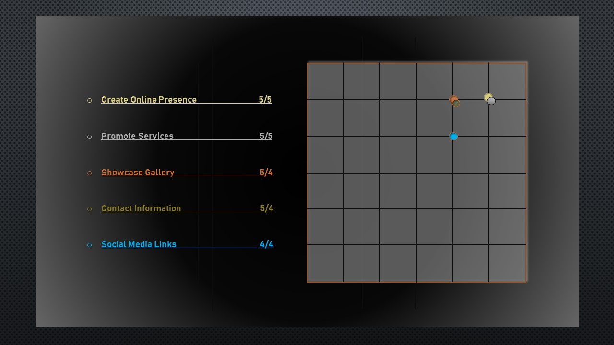
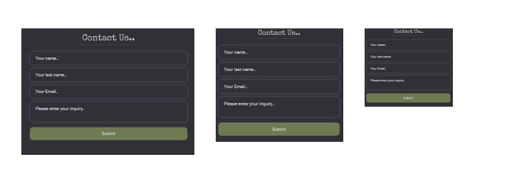

# Floral Fantasy  

## User Experience (UX), HTML5 and CSS, Milestone Project. 

## [View the live project here.](https://raivis80.github.io/First-Milestone-Project/) 

### Table of contents

1. [Introduction](#Introduction)
1. [Ux](#UX)
   - [User Stories](#User-Stories)
   - [Development Planes](#Development-Planes)
   - [Design](#Design)
1. [Features](#Features)
   - [Design features](#Design-features) 
   - [NavBar](#NavBar)
   - [About Us](#About-Us)
   - [Floral-Fantasy Picks Feature](#Floral-Fantasy-Picks-Feature)
   - [Gallery](#Gallery)
   - [Recent Reviews](#Recent-Reviews)
   - [Contact Form](#Contact-Form)
   - [Footer](#Footer)  
1. [Testing](#Testing)
   - [TESTING.md](TESTING.md)
   - [Bugs and Issues TESTING.md](TESTING.md#Bugs-and-Issues)
   - [W3C-Validation TESTING.md](TESTING.md#W3C-Validation)   
1. [Technologies and Frameworks](#Technologies-and-Frameworks)
   - [Languages Used](#Languages-Used)
   - [Frameworks, Libraries & Programs Used](#Frameworks,-Libraries-&-Programs-Used)  
1. [Deployment](#Deployment)
   - [Deployment on GitHub Pages](#Deploying-on-GitHub-Pages)
   - [Forking the Repository](#Forking-the-Repository)
   - [Creating a Clone](#Creating-a-Clone)
1. [Credits](#Credits)
   - [Helpfull sites](#Helpfull-sites)
   - [Images](#Images)
   - [Acknowledgements](#Acknowledgements)

# [&#8686;](#Floral-Fantasy)
## ***Introduction***

This website was designed for florists. The main focus of the site is to create an online presence allowing members to receive venu or occasion flower arrangement quotes from the best wedding florists and to find out relevant information. 

This is the first of four Milestone Projects that the developer must complete during their Full Stack Web Development Program at The Code Institute. 

The main requirements were to make a responsive website with a minimum of three pages using primarily *HTML5* and *CSS3*.

# [&#8686;](#Floral-Fantasy)
## ***UX*** 
### **User Stories**
#### New/Potential users:
1. Wedding planners.
1. Event organisers.
1. General Users looking for flower arrangements.
1. Current customers.

#### External Visitor's goal's:
1. To get quotes for weddings flower arrangemens or event flower arrangements.
1. To be able to navigate throughout the site to find any occasion flower arrangements.
1. To locate Information of the location and contact details.
1. To locate links to social media for external resources. 

#### Site owner's goal's:
1. To be able to attract and retaining potential customers.
1. Showcase photos from the flower Bouquets, events catalog.
1. Merchandise occasion flower arrangements.
1. To Provide Social media links to external resources and contact information.

# [&#8686;](#Floral-Fantasy)
## ***Development Planes***
### **Strategy**

#### Target audiences:
1. Wedding planners.
1. Event organisers.
1. General Users looking for flower arrangements.
1. Current customers.

#### The website needs to enable the User to:
1. To find floraal products and/or services.
1. To navigate site easily through categories clearly.
1. To find showcase gallery to see company's work.
1. To easily find company's Contact information.
1. To find company on their preferred social media platform.

#### The website needs to enable the company to:
1. To create an online presence for the floral company.
1. To provide a good site navigation to easy and quickly find the relevant information.
1. To promote the products and/or services.
1. To showcase floral artist work to create a thumbnail gallery.
1. To Provide user with contact information.
1. To Provide user with social media links.



# [&#8686;](#Floral-Fantasy)
### **Scope**

#### Functionality Requirements
1. Easy website navigation to quickly find the information 
1. Picture Display gallery to showcase latest work.
1. Contact Form and contact Information.
1. Links to external resources such as social media.
1. Responsive design to be able target broader audiences.

#### Content Requirements
1. Landing Page
   - Descriptive Hero image
   - Large Description responsive text overlay
1. About Page
   - "About Us" description
   - "Who we are" description
   - "What we do" description
   - Later added "Floral-Fantasy Picks" feature
1. Gallery
   - Showcase thumbnail Gallery content
1. Contact Form
1. Footer
   - Address information
   - Contact information
   - Embeded location Map

# [&#8686;](#Floral-Fantasy)
### **Structure**

 

- NavBar 
   - Branding
   - Navigation Links
   - Social Links
- Landing Page
   - Large description 
   - Background Hero Image
- "About us" *page was added latter after discussions with Mentor*
   - About us.
   - Why Us.
   - What we do.
   - Floral-Fantasy "Picks Feature" *was added later to compliment "About us" Page design*
- Gallery page
- Recent reviews
- Contact form
   - "Name field"
   - "Last-Namee field"
   - "eMail field"
   - "Text-Area field"
   - "Submit button"
- Footer
   - Social Links
   - Address block
   - Contact information Block
   - Location Map
#
#### **Quick sketch**
    
#
#### **Wireframes**


# [&#8686;](#Floral-Fantasy)
## ***Design***
### **Colour Scheme**
- Colour palette used [View](https://coolors.co/8a5275-bc626f-35372f-a96260-9e5785-ebebeb-1d1d20)
### **Fonts**
-  ROBOTO font is the main font used Serif as the fallback, family Yellowtail and family Special Elite was used for most of the headings.
### **Media**
-   Large, background image is designed to be striking and catch the user's attention.
-   Photo Gallery & Product Image Gallery helps you display and promote product or service.

# [&#8686;](#Floral-Fantasy)
## ***Features***
### **Design features**

 Website features the Long-Scrolling design with four pages such as: "Home", "About Us", "Galery" and "Contact Us" page.

 Website is Responsive on most devices such as: mobile devices and Large screen deskFloral-Fantasy PC's.

 

#
### **NavBar**

  Features customized bootstrap NavBar with Bootstrap5 elements such as: "d-none d-sm-block" to display/hide elments to viewport size. Bootstrab drop-down menu was modified for mobile devices.

  NavBar is Fully responsive, with 3 designs such as: for deskFloral-Fantasy computers, tablet devices and for mobile devices.

  NavBar Features: "Site Link Block Element" is to help navigate the site, "Social Media Links element" displays link icons to various social media platforms, "Brand link block element" is text hyperlink and it will refresh the page.

  NavBar has display Property "Fixed". As you scroll it will remain fixed at the Floral-Fantasy of the browser's viewport.    


#
### **Home Page** 
  Large background image span the full width across the whole viewport and shrinks in size as viewport decreases. Hero background image and color overlay creates a better background for text while being more appealing than a solid background color.
  
  Gradient-efect-overlay is used over the background image to blend background Image color and NavBar color to the website background. 
  Gradient-efect-overlay was placed over background image using CSS declaration "position:absolute" and CSS declaration "position:relative" for Gradient-efect-overlay to position over the image"
  
  Home Page Large font was set CSS property min & max font size, that is responsive to all other browser sizes. Positioning text over image with CSS property  "position: absolute" along with CSS property "z-index".


#
### **About Us**
  
  "About Us" page features three visualy apealing, descriptive images and speaks to user before the quote does.

  Each image has one very telling quote, describing user who the company is, why choice the company and what company does.

  "About us" page was designed flexbox layout design for responsive website.

  Original "about us" page was designed using CSS properties such as float, positioning of elements. But later it was redesigned as it was inconvenient for responsive design and required element repositioning on each screen size. And it was redesigned following responsive FlexBox Design as for viewport width changes sizes.


#   
### **Floral-Fantasy Picks Feature** 
    
  "Floral-Fantasy Picks" Feature represents four thumblail images with current offers for the company. 
    
  "Floral-Fantasy Picks" Feature was designed to be responsive and using FlexBox design for responsiveness.
    
  "Floral-Fantasy Picks" Feature was designed to overlap each image using negative margin and CSS property z-index. Text was palced over the images using CSS declaration "position:absolute".
    
  "hover" pseudo-class was used with transition effects "rotate, translate and scale" for each card to create visual effect such as scale and rotate 6deg on mouse-over.
  


#
### **Gallery** 
  Thumbnail Gallery is a grid of images that when clicked on opens in a pop-up full view images. 
  
  The gallery configuration designed to have smaller images for Thumbnails and Large Images stored separately on the website.
   
  The gallery is fully responsive. Bootstrap Grid system was used for responsive gallery layout desing.

 

#
### **Recent Reviews**
  Reviews feature is fully responsive. Bootstrap5 Grid system was used for responsive gallery layout.
  
  For the content inside review box FlexBox design was implemented to align image next to a paragraph and to be responsive.


#
### **Contact Form** 
  Contact Form is responsive on most devices with maximum width 600px.
  
  Follow this guide to create a contact form [here](https://www.w3schools.com/css/tryit.asp?filename=trycss_forms)
  
  Custom background colour for browser autocomplete function for the contact form input field. Solution was found [here](https://stackoverflow.com/questions/2781549) With W3C CSS Validation Warning.
    


#
### **Footer**
  Footer has 3 main block elements: "address for the company", "Contact Information", "Google Map embeded".
    
  Footer was designed to be responsive using FlexBox system design. CSS Media query technique with FlexBox CSS declaration "flex-item :order" was used to rearrange Element order for mobile devices.
   
  Embedding a Google map in the footer with iFrame for a business location. 
   
  Floral-Fantasy of the footer features social media links.


# [&#8686;](#Floral-Fantasy)
## [TESTING](TESTING.md)
- Testing information can be found in a separate testing file [TESTING.md](TESTING.md)
- Bugs and Issues moved to the TESTING file here [TESTING.md#Fixed-Bugs-and-Issues](TESTING.md#Bugs-and-Issues)
- W3C-Validation moved to the TESTING file here [W3C-Validation TESTING.md](TESTING.md#W3C-Validation)  

# [&#8686;](#Floral-Fantasy)
## **Technologies and Frameworks**

### **Languages Used**
-   [HTML5](https://en.wikipedia.org/wiki/HTML5) Hypertext Markup Language (HTML)
-   [CSS3](https://en.wikipedia.org/wiki/Cascading_Style_Sheets) Cascading Style Sheets (CSS)

### **Frameworks, Libraries & Programs Used**
- [Bootstrap 5.0.0-beta2:](https://getbootstrap.com/docs/5.0/getting-started/download/) was used to assist with the responsiveness and to style the website.
- [Google Fonts:](https://fonts.google.com/) were used throughout the site.
- [Font Awesome:](https://fontawesome.com/) was used throughout the website to add icons.
- [jQuery:](https://jquery.com/) came with Bootstrap.
- [Git](https://git-scm.com/) Git was used for version control.
- [GitHub:](https://github.com/) used to store the projects code.
- [gitpod.io](https://gitpod.io/) gitpod Was used for codding.
- [Balsamiq:](https://balsamiq.com/) was used to create the wireframes.

# [&#8686;](#Floral-Fantasy)
## ***Deployment***
### **Deploying on GitHub Pages**
1. Log into [GitHub](https://github.com/login "Link to GitHub login page") or [create an account](https://github.com/join "Link to GitHub create account page").
1. Locate the [GitHub Repository](https://github.com/Raivis80/First-Milestone-Project/ "Link to GitHub Repo").
1. At the Floral-Fantasy of the repository, select Settings from the menu items.
1. Scroll down the Settings page to the "GitHub Pages" section.
1. Under "Source" click the drop-down menu labelled "None" and select "Master Branch".
1. Upon selection, the page will automatically refresh meaning that the website is now deployed.
1. Scroll back down to the "GitHub Pages" section to retrieve the deployed link.
1. At the time of submitting this Milestone project the Development Branch and Master Branch are identical.

### **Forking the Repository**
1. Log into [GitHub](https://github.com/login "Link to GitHub login page") or [create an account](https://github.com/join "Link to GitHub create account page").
1. Locate the [GitHub Repository](https://github.com/Raivis80/First-Milestone-Project "Link to GitHub Repo").
1. At the Floral-Fantasy of the repository, on the right side of the page, select "Fork"
1. You should now have a copy of the original repository in your GitHub account.

### **Creating a Clone**
1. Install the [GitPod Browser](https://www.gitpod.io/docs/browser-extension/ "Link to Gitpod Browser extension download") Extension for Chrome.
1. After installation, restart the browser.
1. Log into [GitHub](https://github.com/login "Link to GitHub login page") or [create an account](https://github.com/join "Link to GitHub create account page").
1. Locate the [GitHub Repository](https://github.com/Raivis80/First-Milestone-Project"Link to GitHub Repo").
1. Click the green "GitPod" button in the Floral-Fantasy right corner of the repository.
This will trigger a new gitPod workspace to be created from the code in github where you can work locally.

**How to run this project within a local IDE, such as VSCode:**
1. Log into [GitHub](https://github.com/login "Link to GitHub login page") or [create an account](https://github.com/join "Link to GitHub create account page").
1. Locate the [GitHub Repository](https://github.com/Raivis80/First-Milestone-Project "Link to GitHub Repo").
1. Under the repository name, click "Clone or download".
1. In the Clone with HTTPs section, copy the clone URL for the repository.
1. In your local IDE open the terminal.
1. Change the current working directory to the location where you want the cloned directory to be made.
1. Type 'git clone', and then paste the URL you copied in Step 3.
```
git clone https://github.com/USERNAME/REPOSITORY
```
8. Press Enter. Your local clone will be created.

  Further reading and troubleshooting on cloning a repository from GitHub [here](https://docs.github.com/en/free-pro-team@latest/github/creating-cloning-and-archiving-repositories/cloning-a-repository "Link to GitHub troubleshooting")

# [&#8686;](#Floral-Fantasy)
## ***Credits***
### **Helpfull sites**
-  [placeholder.com](https://placeholder.com/): Free Image Placeholder.
-  [stackoverflow.com](https://stackoverflow.com/): Useful website for code tips.
-  [www.w3schools](https://www.w3schools.com/): Useful website for code tips.
-  [Bootstrap5](https://getbootstrap.com/): Bootstrap Library was used to make site responsive.
-  [coolors.co](https://coolors.co/): Colour palettes.
-  [pexels.com](https://www.pexels.com/): Images used throughout site.

### **Images** 
- #### **All the images comes From Here [pexels.com](https://www.pexels.com/)** 
#### **Main Image**
 - pexels-visually-us-1477166
#### **Galery images**
- pexels-visually-us-1477166
- pexels-cottonbro-4270232
- pexels-craig-adderley-2306275
- pexels-dmitry-zvolskiy-1721942
- pexels-emma-bauso-3585806
- pexels-fernanda-pereira-3885128
- pexels-ivan-57980
- pexels-olya-kobruseva-4661607
- pexels-rocsana-nicoleta-gurza-948185
#### **Review images** 
- pexels-amber-janssens-6847775 
- pexels-christina-morillo-1181424
- pexels-deden-dicky-ramdhani-2916263  
- pexels-la-miko-3681591
 
### **Acknowledgements**
- A huge thanks to Owonikoko Oluwaseun, My Mentor for continuous support and inspire me to push myself beyond where I think I can go.
- Tutor support at Code Institute for their support.

# [&#8686;](#Floral-Fantasy)