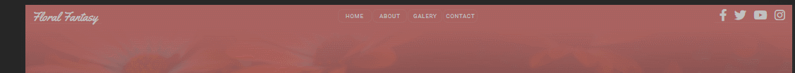
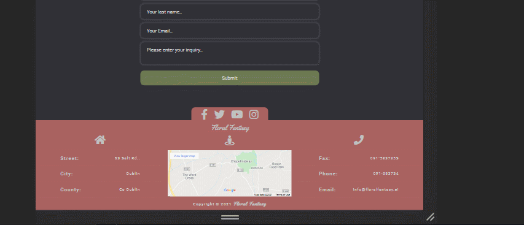
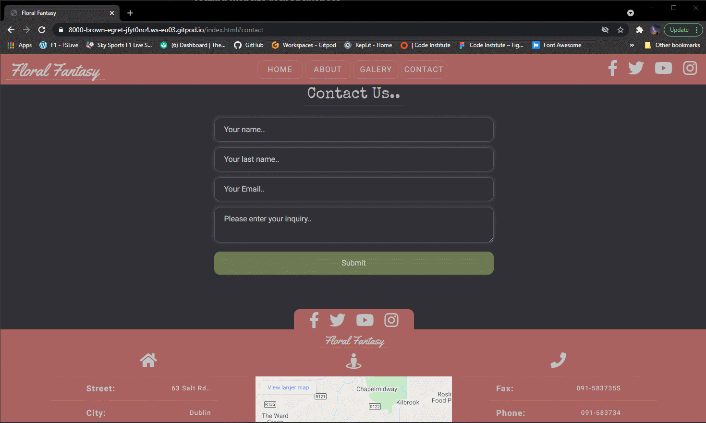
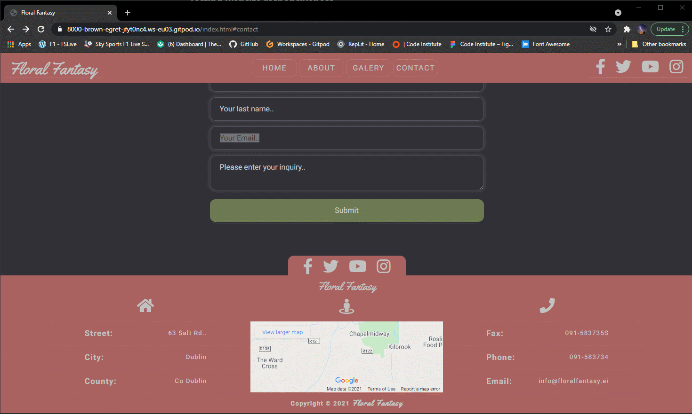
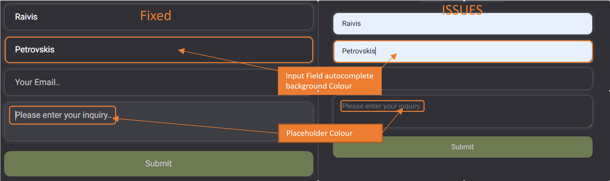
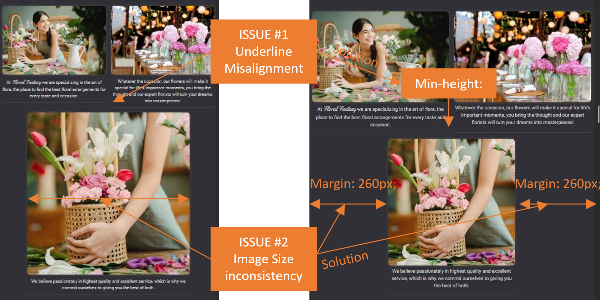

## ***Testing***

### **Table of contents**

1. [Testing Website responsive design](#Testing-Website-responsive design)
    - [NavBar responsive design](#Testing-Navigation-responsive design)
    - [Home Page responsive design](#Testing-Home-Page-responsive design)
    - [About Page responsive design](#Testing-About-Page-responsive design)
    - [Gallery responsive design](#Testing-Gallery-responsive design)
    - [Review and Contact form responsive design](#Testing-Review-and-Contact-Form-responsive design)
    - [Footer responsive design](#Testing-Footer-responsive design)
1. [Testing Functions and Links](#Testing-Functions-and-Links)
    - [NavBar Functions and Links](#Testing-NavBar)
    - [Top Picks Functions and Links](#Testing-Top-Picks-Feature)
    - [Gallery Functions and Links](#Testing-Thumblail-Gallery)
    - [Gallery Functions and Links](#Testing-Gallery-responsive design)
    - [Contact form Functions and Links](#Testing-Contact-Form)
    - [Footer Functions and Links](#Testing-Footer-Links)
1. [Further Testing](#Further-Testing)
1. [W3C Validation](#W3C-Validation)
1. [Bugs and Issues](#Bugs-and-Issues)
1. [Fixed Bugs and Issues](#Fixed-Bugs-and-Issues)
1. [Back to README.md](README.md)

# [&#8686;](#Testing)
## ***Testing Website responsive design***
### **Testing Navigation responsive design**
    
For responsive NavBar, I'm using flexbox system with some bootstrap-5 components, and bootstrap-5 Javascript function for the toggle, drop-down menu. 

Navigation Bar will remain fixed at the top of the browser's viewport. I'm using CSS Property "display" with value "fixed" as you scroll the page, Navigation Bar will remain fixed at the top of the browser's viewport.

#
### **Testing Home Page responsive design**
   
For the responsive font size of "home Page" I have set "min & max" font size property in CSS, that is responsive to all other browser sizes viewport.

#
### **Testing About Page responsive design**
    
I'm using FlexBox design for "About us" page responsive design.

For tablet and mobile device elements reordering I'm using CSS FlexBox property "order".

For desktop device elements I'm using FlexBox declaration "flex-direction: row;", and for mobile device for elements "flex-direction: column;".

#
### **Testing Gallery responsive design**

For the "Gallery" responsive design I'm using Bootstrap 5 Grid system.

In order to hide some of the images for mobile devices, I'm using media queries with CSS declaration "display: none;".

#
### **Testing Review and Contact Form responsive design**

For "review area" responsive design I'm using Bootstrap Grid system.

For the "Contact form" responsive design I'm using CSS declaration "max-width: 600px;", so that form can shrink in size but won't grow in width over 600 pixels.

#
### **Testing Footer responsive design**

For Footer  for responsive design, I'm using FlexBox system. 

For mobile devices, to change the order of the elements, I'm using CSS Media query technique along with FlexBox CSS declaration "flex-item :order".

# [&#8686;](#Testing)
## ***Testing Functions and Links***
### **Testing NavBar**

 NavBar brand element features link element and when clicked on the page will reload.
 
 NavBar features navigation menu links. The links in the main navigation lead to pages within the site.
 
 For mobile devices, I'm using drop-down Navigation menu. It is activated on viewport sizes and to hide or display navigation menu items, I'm using bootstrap 5 grid properties such as: "d-none d-sm-block" along with the Media Queries techniques.
 
 Navbar also features links to the social media platforms. I'm using font awesome for the link icons, and a target="_blank" attribute for the links to open in a new browser tab.

#
### **Testing Top Picks Feature**

"Top Picks" Feature was designed to overlap each image using negative margin along with whe CSS property z-index.

Pseudo-class "hover" was used with transition effects "rotate, translate and scale" for each card to create visual effect such as: scale and rotate 6deg on mouse-over.

#
### **Testing Thumblail Gallery**

To improve website gallery performance, I'm using thumbnails "compressed versions of the images", and by linking a thumbnails to the full size images, that will open in a pop-up, new tab browser window. 

#
### **Testing Contact Form**

Contact form was tested for list of input field content types, and that a server processing this form, will handle the content types correctly. 

Contact form was tested, for the input field correct "required" attribute functionality.
 

#
### **Testing Footer links**

Footer features links to common social media platforms menu with icons from the free fontawesome library.

Footer Features a call link as well as a few other clickable links such as eMail and Fax Link.

I'm using a target="_blank" attribute for the links to open in a new browser tab.

# [&#8686;](#Testing)
## **Further Testing**

Website was tested on Chrome, Opera and Firefox desktop version browsers and on Iphone 11 Safari, huawei p30 Pro chrome and android browser.

Chrome DevTools was used to Test variety of devices such as Desktop, Laptop, iPhone7, iPhone 8 & iPhoneX for responsive design.

Testing was done to ensure that all Links were linking correctly.

# [&#8686;](#Testing)
## **W3C Validation**
  The W3C Markup Validator and W3C CSS Validator Services were used to validate every page of the project to ensure there were no syntax errors in the project.

- [W3C Markup Validator](assets/project-files/validators/HTML-Vaalidator.pdf)
- [W3C CSS Validator](assets/project-files/validators/CSS-Validator.pdf)

# [&#8686;](#Testing)
## **Bugs and Issues**
### *hide scroolBar for the browser*
#### **W3C CSS Validation Warning**
"::-webkit-scrollbar is an unknown vendor extended pseudo-element" *Hide scrollbar for Chrome*   
    
Code is still in use In order to Validate CSS solution is not to use the following code:
    
    "html::-webkit-scrollbar display: none;"

#### **W3C CSS Validation Warning**
"-ms-overflow-style is an unknown vendor extension"  *Hide scrollbar for IE, Edge*

Code is still in use In order to Validate CSS solution is not to use the following code:
    
    "html::-webkit-scrollbar display: none;"

### *Input Form Autofill and input form custom background color*
#### **W3C CSS Validator Warning** 
"::-webkit-input-placeholder is an unknown vendor extended pseudo-element" *Custom input form placeholder font color*
    
This code is in use to match website color sheme. In order to Validate CSS solution is not to use the following code:
    
    ".contact--form input::-webkit-input-placeholder"

#### **W3C CSS Validator Warning**
"-webkit-background-clip is an unknown vendor extension" *Custom input form background color*
   
This code is in use to match website color sheme. In order to Validate CSS solution is not to use the following code: 
    
    "background-clip: text;"

#### **W3C CSS Validator Warning** 
"-webkit-text-fill-color is an unknown vendor extension" *Custom input form background color*
    
This code is in use to match website color sheme. In order to Validate CSS solution is not to use the following code: 
    
    "-webkit-text-fill-color: rgb(255, 255, 255);"

# [&#8686;](#Testing)
## **Fixed Bugs and Issues**

#### **W3C CSS Validation ERROR** 
"Property scrollbar-width doesn't exist : none" *Hide scrollbar for Firefox browser*
    
In order to Validate CSS I have solved this issue by removeing following declaration from the CSS: 
    
    "scrollbar-width: none;"

#### **W3C CSS Validation ERROR**  
"input:-webkit-autofill	text is not a background-clip value : text" *Input Form autocomplete custom background colour* 
    
In order to Validate CSS I have solved this issue by removeing following declaration from the CSS:
    
    "-webkit-background-clip: text;"

#### **W3C CSS Validation Warning**
"-moz-max-content is an unknown vendor extension" Mozilla Firefox css property maximum width fit content

In order to Validate CSS I have solved this issue by replacing it with the following CSS declaration:

    "width: max-content;"  Text will not wrap with this declaration but it works in my case.

#### **Firefox "width: fit-content;" issue**
An issue with CSS Declaration "width: fit-content;" does not work on Firefox browser. I Googled for "fit-content aternative" and CSS Declaration "width: max-content;" and it worked.  Text does not wrap, but in my case it is accetable and Solution works.
#### **Navigation Bar issues**
Custom colors, position and width was used for the Boostrap NavBar. Most of the Bootstrap NavBar components was redesigned and replaced. 

Drop-down menu, bootstrap toggle hamburger menu was replaced with font awesome "bars" icon to match website color scheme.                                      
#### **Content Overflow issues**
I had an issue with content overflow on the right side, on mobile devices. Using Chrome DevTools I was able to detect that, most of the time there was issues with bootstrap grid system paddings. Using CSS Declaration "padding: 0;" I was able to resolve most of them.
#### **Contact Form issues** 
Issue with contact form custom background color and placeholder text color to match the website color sheme. Solution was found [here](https://stackoverflow.com/questions/2781549/removing-input-background-colour-for-chrome-autocomplete) with W3C CSS Validation warnings.

#### **Top Picks overflow issues**
There was an issue with "top picks" feature text overflow, on devices smaller than 280px in width. The issue was solved using CSS declaration "font-size: .6rem;"
#### **About Us" page issues** 
Issue with text block element, underline allignment on "contact us" page for tablet devices. Underline missalignment was solved using "min-height" CSS declaration for text block elements.

Another issue with "About Us" page, as the viewport decreased in width, one of the 3 images shifted below the top two images and width for the image below, was wider than the width of the the two images above.
I was able to solve the issue using media queries. For the single image I was using margins left, right as viewport decrease, the images compress at the same rate as the two images above.

 # [&#8686;](#Testing)